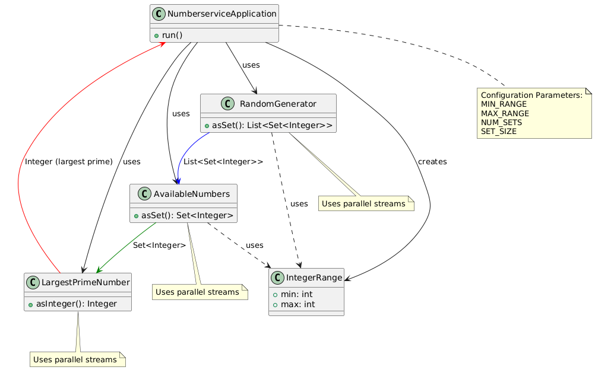
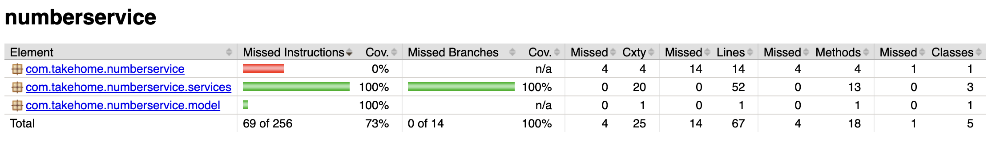

# Number Service

## Description
Number Service is a Spring Boot application that generates random sets of numbers, identifies available numbers within a specified range, and finds the largest prime number among the available numbers.

## Service structure
- Main Application (NumberserviceApplication)
- RandomGenerator Service
- AvailableNumbers Service
- LargestPrimeNumber Service
- IntegerRange Model



This diagram was generated from [architecture.puml](doc/architecture.puml) using the [PlantumUML online service](https://plantuml.com/)

## Data flow
```asciidoc
Input: Configuration parameters
- MIN_RANGE
- MAX_RANGE
- NUM_SETS
- SET_SIZE

1. NumberserviceApplication
   |
   v
2. RandomGenerator (uses parallel streams)
   Input: IntegerRange(MIN_RANGE, MAX_RANGE), SET_SIZE, NUM_SETS
   Process: Generates random sets in parallel
   Output: List<Set<Integer>>
   |
   v
3. AvailableNumbers (uses parallel streams)
   Input: List<Set<Integer>>, IntegerRange(MIN_RANGE, MAX_RANGE)
   Process: Identifies available numbers in parallel
   Output: Set<Integer> (available numbers)
   |
   v
4. LargestPrimeNumber (uses parallel streams)
   Input: Set<Integer> (available numbers)
   Process: Checks primality and finds largest in parallel
   Output: Integer (largest prime)

Note: Parallel streams are used in each service to potentially improve performance
on multi-core systems. By default, on single-core systems, parallel streams may not
provide performance benefits and could introduce overhead. The actual
performance gain depends on the available hardware and the size of the data set.
```

## Features
- Generates random sets of numbers within a specified range
- Identifies available numbers not present in the generated sets
- Finds the largest prime number among the available numbers
- Configurable via environment variables

## Prerequisites
- Java 24
- Maven
- Docker

## Configuration
The application can be configured using the following environment variables:
- `MIN_RANGE`: The minimum value for the number range (default: 0)
- `MAX_RANGE`: The maximum value for the number range (default: 100)
- `NUM_SETS`: The number of sets to generate (default: 5)
- `SET_SIZE`: The size of each generated set (default: 5)

## Build and run
Build and run the application using the following bash script:
```bash
./build_and_run.sh
```
## Test coverage
[Report Location](target/site/jacoco/index.html)

100% Test coverage right after finishing with the 3 services without any modification to the code or tests:


## Decisions made and thought process

### Technology choices
- Selected Java 24 as the highest officially supported version by Spring Boot 3
- Chose the popular OpenJDK implementation
- Used https://start.spring.io/ to generate the project's skeleton

### Development approach
- Created a new TO-DO list to document future tasks while using the provided documentation as a guide
- Implemented using Test-Driven Development (TDD) approach

### Component implementation
1. Generator:
    - Used Set to ensure no duplicates are returned
    - Implemented using Java 17's new random generator
    - Introduced IntegerRange to manage parameters efficiently (limiting the number of parameters passed to constructors or functions)

2. AvailableNumbers:
    - Introduced RandomGeneratorI interface for testing purposes
    - Considered Mockito as an alternative but opted for interface implementation

3. LargestPrimeNumber:
    - Defined class skeleton, constructor, and method signature
    - Used Optional as return type
    - Leveraged AI for method implementation, adding logging and optimization documentation

### Multithreading approach
- Chose parallel streams (implementation of ExecutorService) for simplicity and desired parallelization
- Noted potential issues with thread starvation when using platform threads
- Suggested future improvements:
    - Consider using Virtual Threads (Java 21+)
    - Explore structural concurrency in future Java versions
    - Noted compatibility with Spring Boot and adoption by Netflix

### Documentation
- Used AI to generate JavaDocs

### Alternative considerations
- RxJava and WebFlux are alternatives, but prefer Virtual Threads for Java multithreading for modern Java

### Code quality
- Achieved 100% test coverage for the 3 main services without code modifications

## Possible improvements

### Generator
1. Input Validation:
    - Validate generator input parameters
    - Handle edge cases, e.g., needing to generate 10 unique values but the range of values selected is 0-5.
    - Ensure Min <= Max

2. Random Number Generation:
    - Currently using Java 17's default random generator
    - Consider selecting a specific generator for the task
    - Be cautious of potential changes in default implementation over time

3. Number Range:
    - Current assumption: numbers are positive only
    - Add tests with negative numbers if needed

### LargestPrimeNumber
1. Primality Check Optimization:
    - The `isPrime()` method could theoretically use a parallel stream of integers
    - However, this would conflict with the current "i*i" optimization
    - Further investigation needed to determine the most efficient approach

### General improvements
1. Error Handling:
    - Implement robust error handling and reporting mechanisms
    - Provide clear error messages for invalid inputs or edge cases

2. Performance Testing:
    - Conduct thorough performance tests with various input sizes
    - Optimize for both small and large data sets

3. Configurability:
    - Consider making more aspects of the application configurable
    - Allow users to choose between different random number generation strategies

4. Logging:
    - Implement more comprehensive logging throughout the application
    - Consider using a structured logging format for easier analysis

5. Continuous Integration:
    - Set up CI/CD pipelines for automated testing and deployment
    - Implement code quality checks (e.g., SonarQube) in the pipeline

## Lessons learned and other suggestions

### Data structures and performance
1. Set Implementation Details:
    - Sets use hash codes for storing values
      - Sequential integer sets (e.g., [0, 1, 2, 3, 4]) have incrementing hash codes which can be suprising at first when the set contains only single digits, sorted by value/hash value.

### Concurrency and parallelization
1. Platform Threads vs. Parallelization:
    - Recent parallelization often uses platform threads
    - This approach increases the risk of thread starvation
    - Trade-off: Thread availability for concurrent requests vs. faster completion of individual requests

2. Considerations:
    - Evaluate whether to prioritize handling many concurrent requests or faster processing of individual requests
    - Consider the impact on overall system performance and responsiveness

### Documentation and visualization
1. Diagram Maintenance:
    - Tools like Structurizr and PlantUML enable code-based diagram creation
    - Flow, system, and component diagrams can be maintained within the codebase
    - Benefits:
        - Version control for diagrams
        - Automated diagram generation as part of the build process
        - Improved consistency between code and documentation

2. Integration with Development Workflow:
    - Incorporate diagram updates into the regular development process
    - Ensure diagrams are reviewed and updated alongside code changes

### Continuous improvement
1. Regular Review:
    - Periodically reassess architectural decisions in light of new learnings
    - Stay informed about advancements in Java concurrency models (e.g., Virtual Threads)

2. Performance Monitoring:
    - Implement monitoring to validate assumptions about parallelization and data structure performance
    - Use real-world data to guide optimization efforts
